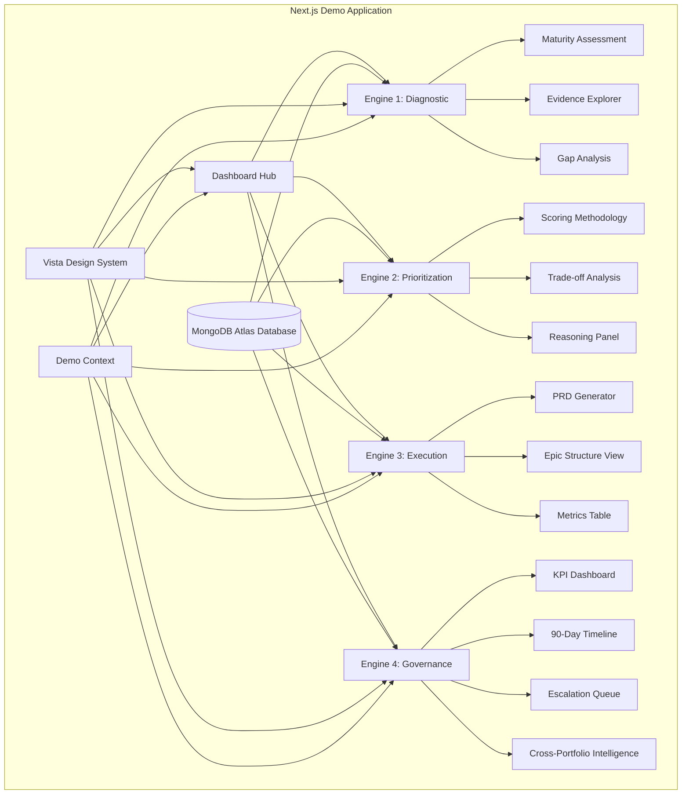

# Portfolio AI Accountability Playbook - Product Requirements Document

## Executive Summary

Vista Equity Partners faces a critical challenge: driving **systematic, sustainable behavioral change around AI and product management tooling adoption across 90+ portfolio companies**. Current operating partner engagements result in only partial implementation—recommendations die when priorities shift or people leave. Board pressure exists, but actual behavioral change is lacking. Vista's VP of Product hiring mandate requires a system that solves the "hired gun problem": making companies drink, not just leading them to water.

The proposed solution is a **Vista-branded Product Operating System demo** powered by Yansu/Isoform, built as an interactive Next.js application. This demo showcases how systematic accountability mechanisms transform the post-investment engagement model by demonstrating the complete four-engine lifecycle: diagnostic maturity assessments (Engine 1/Diagnostic), transparent prioritization with explicit reasoning (Engine 2/Prioritization), automated PRD generation (Engine 3/Execution), and KPI-driven governance with cross-portfolio intelligence (Engine 4/Accountability). Unlike traditional frameworks that stop at analysis and prioritization, this system turns decisions into shipped engineering artifacts and creates persistent accountability layers that continue operating after the engagement concludes, while compounding institutional intelligence across the portfolio.

Expected impact includes Vista establishing a competitive advantage through compounding institutional intelligence—by engagement 50, Vista would possess an intelligence layer no PE firm can replicate, enabling systematic AI adoption across the portfolio through self-deployable systems that get smarter with each use.

## Requirements & Scope

### Functional Requirements

**REQ-1**: The application shall use Next.js as the technical platform

**REQ-2**: The application shall display Vista branding throughout the interface

**REQ-3**: The application shall implement a dashboard hub navigation structure allowing users to access different demo sections

**REQ-4**: The application shall showcase Engine 3 (Execution) capabilities including:

- PRD generation functionality displaying structured documents with acceptance criteria, edge cases, and technical constraints
- Epic/story structure visualization ready for engineering intake
- Time reduction metrics comparison table showing manual process vs. Product Operating System

**REQ-5**: The application shall showcase Engine 4 (Governance) capabilities including:

- KPI dashboard displaying progress against the original prioritization reasoning
- 90-day execution plan visualization with automated weekly progress tracking
- Escalation trigger display for stalled priority items

**REQ-6**: The application shall include realistic mock data for Portside scenario, including:

- **Customer Interview Source Materials**: 8-10 interview transcript excerpts with thematic tagging (pain points: scheduling fragmentation, compliance visibility, mobile limitations; opportunities: AI assistance, integration depth, analytics expansion; sentiment indicators: promoter/passive/detractor classification with supporting quotes)
- **Support Ticket Category Breakdown**: Categorized ticket data with resolution metrics including volume by category (scheduling conflicts 47%, compliance reporting 23%, mobile access 18%, other 12%), average resolution times (critical 4 hours, high 24 hours, medium 72 hours, low 168 hours), escalation rates by category, and satisfaction scores post-resolution
- **NPS Score Distributions**: Net Promoter Score data with verbatim comments including score distribution (promoters 34%, passives 41%, detractors 25%), key themes from open-text responses (top positive: ease of use, customer support; top negative: mobile experience, integration gaps), trending analysis (quarter-over-quarter score movement), and correlation with customer tenure and product usage depth
- **Product Usage Analytics**: Detailed usage metrics with adoption rates and drop-off funnels including feature adoption by module (scheduling 89%, compliance 67%, mobile app 45%, API integrations 23%), user engagement funnels (onboarding completion 72%, core feature activation 58%, advanced feature adoption 31%), session duration and frequency trends, power user identification criteria (daily active, 5+ features used), and churn risk indicators based on usage pattern decay
- **Maturity Assessment Baseline Scores**: Portfolio peer benchmark data showing Portside relative positioning across four dimensions (Customer Discovery Depth, Roadmap Clarity, Execution Velocity, Governance Rigor) with percentile rankings against 90+ portfolio companies, industry vertical comparisons (aviation SaaS vs. manufacturing vs. healthcare), and improvement trajectory recommendations
- Horizon platform details (cloud-based flight management system)

**REQ-7**: The application shall support full journey self-guided demo flow from Engine 1 through Engine 4 covering all four acts of the presentation framework

**REQ-8**: The application shall display the measurable impact comparison table with metrics for PRD creation, prioritization cycle, decision documentation, time to eng-ready artifacts, and rework rates

**REQ-9**: The application shall demonstrate traceability from prioritization decisions through PRD to execution artifacts

**REQ-10**: The application shall include interactive "click-through" animations showing transformation from roadmap item to PRD to epic structure to test scenarios

**REQ-11**: The application shall be deployed on Render platform with subdomain product-os.frederickli.pro

**REQ-12**: The application shall use environment configuration via .env file for sensitive values, with .env excluded from version control via .gitignore. Required environment variables: NEXT_PUBLIC_DOMAIN, NEXT_PUBLIC_GA_MEASUREMENT&lt;mark class="feedback-highlight" data-feedback-id="1c5a3023-86f6-4d2d-8e5e-82b210c23e3e" data-feedback-content="Do you actually want all these specific environment variables defined now, or should we simplify to only what’s essential for the first demo?" title="Do you actually want all these specific environment variables defined now, or should we simplify to only what’s essential for the first demo?" data-is-ai="true"&gt;\_ID, NEXT_PUBLIC_CLARITY_PROJECT_ID, NEXT_PUBLIC_PE_FIRM_NAME, NEXT_PUBLIC_PORTFOLIO_CO_NAME, NEXT_PUBLIC_PRODUCT_NAME, NEXT_PUBLIC_DEVELOPER_NAME, NEXT_PUBLIC_CEO_NAME, MONGODB_URI (MongoDB Atlas connection string for database connectivity)

**REQ-13**: The application shall integrate Google Analytics for tracking demo engagement, with the tracking ID stored in the NEXT_PUBLIC_GA_MEASUREMENT_ID environment variable

**REQ-14**: The application shall integrate Microsoft Clarity for user behavior analytics, with the project ID stored in the NEXT_PUBLIC_CLARITY_PROJECT_ID environment variable

**REQ-15**: The public-facing demo website shall use configurable company names via the NEXT_PUBLIC_PE_FIRM_NAME, NEXT_PUBLIC_PORTFOLIO_CO_NAME, and NEXT_PUBLIC_PRODUCT_NAME environment variables (defaulting to '\[PE Firm\]', '\[Portfolio Co\]', and '\[Software\]' respectively) in all interface elements, mock data displays, and user-facing content. Actual company names ("Vista", "Vista Equity Partners", "Portside") shall not be displayed on the website, while the PRD documentation may retain actual company names for internal reference purposes. Personal names shall be configurable via the NEXT_PUBLIC_DEVELOPER_NAME and NEXT_PUBLIC_CEO_NAME environment variables (defaulting to 'developer' and '\[CEO Name\]' respectively).

**REQ-16**: The GitHub repository shall use configurable company names via the NEXT_PUBLIC_PE_FIRM_NAME, NEXT_PUBLIC_PORTFOLIO_CO_NAME, and NEXT_PUBLIC_PRODUCT_NAME environment variables (defaulting to '\[PE Firm\]', '\[Portfolio Co\]', and '\[Software\]' respectively) in all committed content, including README files, code comments, configuration files, and any other version-controlled files. Actual company names ("Vista", "Vista Equity Partners", "Portside") shall not appear in the repository to ensure public anonymity. Personal names shall be configurable via the NEXT_PUBLIC_DEVELOPER_NAME and NEXT_PUBLIC_CEO_NAME environment variables (defaulting to 'developer' and '\[CEO Name\]' respectively).

**REQ-17**: The application shall include guided walkthrough features enabling independent navigation including:

- Continue prompts that guide users to the next logical step in the demo flow
- Highlight animations that draw attention to interactive elements and new content
- Contextual help icons (?) providing explanatory text when hovered or clicked
- Step-by-step tour mode offering sequential walkthrough of key features
- "Start here" entry point prominently displayed for first-time users

**REQ-18**: The application shall implement analytics tracking for guided element engagement including:

- Tracking interactions with continue prompts (impressions, clicks, dismissals)
- Tracking highlight animation visibility and user engagement responses
- Tracking contextual help icon usage (hover events, click events, time spent viewing help content)
- Tracking tour mode progression (start rate, step completion, drop-off points, completion rate)
- Tracking "Start here" entry point utilization and conversion to full demo flow

**REQ-19**: The application shall instrument 'ah ha' moment workflows to capture insight achievement including:

- Tracking when users reach the maturity assessment visualization showing raw data transformed into structured intelligence (Act 1 core insight)
- Tracking when users see explicit prioritization reasoning with weighted scoring methodology (Act 2 core insight)
- Tracking when users reach the PRD transformation visualization (Act 3 core insight)
- Tracking progression through execution-to-governance transition points
- Tracking engagement with the "most frameworks stop" callout message
- Tracking discovery of the portfolio-scale intelligence anchor message in Act 4 with cross-portfolio pattern panel
- Recording time-to-insight metrics measuring duration from demo start to each key realization moment across all four acts

**REQ-20**: The application shall implement PRD collaboration capabilities including:

- Comment threads allowing stakeholders to discuss specific PRD sections inline
- Approval workflow with visual indicators showing stakeholder sign-off status
- Suggested changes panel displaying proposed edits from team members
- Real-time collaboration indicators showing active reviewer presence
- Change history log tracking revisions and approval decisions

**REQ-21**: The application shall showcase Engine 1 (Diagnostic) capabilities including:

- Maturity assessment visualization displaying current-state product development process evaluation across dimensions: customer discovery depth, roadmap clarity, execution velocity, and governance rigor
- Data synthesis interface showing aggregation of customer interviews, NPS responses, support tickets, and product usage analytics into unified insights
- Diagnostic report generation with scored maturity ratings, identified gaps, and capability benchmarks against portfolio peers
- Evidence explorer allowing drill-down from synthesized insights to underlying source data (interview excerpts, ticket samples, survey responses)

**REQ-22**: The application shall showcase Engine 2 (Prioritization) capabilities including:

- Roadmap synthesis interface displaying prioritized initiatives ranked by scoring methodology
- Explicit prioritization reasoning panel showing justification for each priority score based on weighted factors: revenue impact, churn risk reduction, competitive exposure, technical enabler status, and strategic alignment
- Trade-off analysis view visualizing opportunity costs and resource allocation decisions across competing initiatives
- Stakeholder input aggregation showing how customer feedback, board mandates, and team capacity constraints informed priority rankings
- Priority confidence indicators displaying data quality scores and uncertainty levels for each prioritization decision

**REQ-23**: The application shall include a MongoDB Atlas database configuration using free tier (M0 cluster) with:

- Database connection string configured via MONGODB_URI environment variable in .env file
- Shared local/production database for development simplicity with connection pooling configured for Next.js runtime
- Mock data seeding script (npm run seed) that populates database with Portside scenario data including customer interviews, support tickets, NPS responses, product analytics, and user records
- README documentation with setup instructions covering: MongoDB Atlas account creation, cluster provisioning, IP allowlist configuration, connection string setup in .env, and seed script execution

### Non-Functional Requirements

**NFR-1**: The application shall achieve high visual polish to ensure credibility with Vista's executive stakeholders

**NFR-2**: The application shall load all dashboard components within 3 seconds for smooth demo presentation

**NFR-3**: The application shall maintain consistent Vista branding across all sections including color palette, typography, and visual identity

**NFR-4**: The application shall be fully standalone for independent exploration without any presenter, featuring on-screen guidance, contextual help tooltips, and self-explanatory UI elements that enable Vista to navigate and understand the demo completely unassisted

**NFR-5**: The application shall be production-ready for a 1-day delivery timeline with debugging support available

### Out of Scope

- Actual AI integration or Anthropic API connectivity—demo uses pre-generated, realistic mock responses
- Multi-tenant configuration for production deployment across all Vista portfolio companies
- Real-time data integration with Vista's existing systems
- User authentication, permissions, or session management

### Success Criteria

- Demo successfully demonstrates maturity assessment insights in Act 1 establishing current-state understanding with data synthesis visualization
- Demo successfully demonstrates prioritization reasoning transparency in Act 2 showing explicit trade-off analysis and weighted scoring methodology
- Demo successfully demonstrates PRD generation in under 3 minutes during presentation with full collaboration workflow visualization
- Vista executive stakeholders understand how governance layer persists after operating partner leaves through 90-day plan and escalation triggers
- KPI dashboard clearly shows connection between prioritization reasoning and execution metrics
- Cross-portfolio intelligence panel clearly demonstrates pattern recognition value across 10-50 portfolio companies
- High visual polish yields positive first impression reinforcing Vista brand trust
- Self-guided flow enables Vista to navigate and explore the demo independently without any presenter assistance
- Time reduction metrics table clearly communicates measurable business value
- Four-act narrative maintains stakeholder engagement across 10-minute presentation duration (2+3+3+2 minute structure)

## User Experience & Interface

### User Journey

The demo narrative arc is designed to guide users through a carefully structured four-act progression that builds toward transformative insight moments. The journey begins with diagnostic maturity assessment—establishing the current-state reality of portfolio company product operations. It progresses through transparent prioritization revealing the reasoning behind roadmap decisions. The third act creates the first 'ah ha' moment: when a static priority item transforms into a complete PRD with acceptance criteria, edge cases, and technical constraints through a single interaction. The arc then deliberately builds tension by showing where traditional frameworks fail—the "most frameworks stop" callout—before releasing into the second key insight: the governance layer that persists and scales. The narrative drives users from understanding individual execution acceleration to grasping portfolio-scale institutional intelligence, culminating in the realization that Vista can possess a compounding system rather than static playbooks. Each transition point is instrumented to measure user progression toward these insight moments.

The demo follows the complete four-act presentation framework:

**Act 1 — "Where we actually are" (2 minutes)**

1. User arrives at dashboard hub showing four-quadrant view of Engines 1-4 with Engine 1 highlighted and active
2. SDLC progress stepper displays at top showing: Discovery (active) → Design → Develop → Deploy establishing the starting point of the product lifecycle
3. User navigates to Engine 1 Diagnostic section revealing maturity assessment dashboard
4. Evidence explorer displays synthesized customer interview excerpts, NPS survey breakdowns, support ticket categories, and product usage analytics
5. Maturity assessment visualization scores Portside across four dimensions: Customer Discovery Depth, Roadmap Clarity, Execution Velocity, Governance Rigor
6. Gap analysis panel highlights capability deficiencies: limited customer research cadence, unclear prioritization methodology, inconsistent documentation practices, reactive project management
7. Diagnostic report shows benchmark comparison against portfolio peers revealing Portside below median on discovery and governance dimensions
8. First insight moment: User sees raw data transformed into structured maturity intelligence with clear improvement opportunities
9. Transition prompt: "Diagnosis complete. Now see how priorities emerge from this evidence."

**Act 2 — "How we decide what to build" (3 minutes)**

 1. SDLC progress stepper advances: Discovery (checkmark) → Design (active) → Develop → Deploy
 2. User navigates to Engine 2 Prioritization section with diagnostic insights carried forward via shared context indicator
 3. Roadmap synthesis interface displays candidate initiatives derived from Act 1 diagnostic findings: scheduling-compliance unification, AI copilot features, mobile experience overhaul
 4. Explicit prioritization reasoning panel shows scoring methodology: Revenue Impact (40%), Churn Risk Reduction (25%), Competitive Exposure (20%), Technical Enabler Status (10%), Strategic Alignment (5%)
 5. Trade-off analysis view visualizes opportunity cost of pursuing unified scheduling-compliance platform versus AI copilot capabilities
 6. User sees weighted scoring driving "Unified Scheduling-Compliance Platform" to top priority with confidence score of 87%
 7. Stakeholder input aggregation shows how customer feedback themes, board mandate language, and team capacity constraints informed rankings
 8. Prioritized Roadmap section displays unified scheduling-compliance view as top priority with explicit reasoning visible: "Addresses #1 customer request (47% of support tickets), reduces churn risk by $2.3M ARR, closes competitive gap with Fleetio"
 9. Second insight moment: User understands not just what was prioritized, but why—with transparent reasoning that persists
10. Transition prompt: "Priority set. Now watch the transformation into shipped product."

**Act 3 — "Now watch this turn into shipped product" (3 minutes)**

 1. User starts at dashboard hub with Engine 2 completed state visible and Engine 3 highlighted/active
 2. SDLC progress stepper updates: Discovery (checkmark) → Design (active) → Develop → Deploy with visual flow indicating speed through lifecycle
 3. Stepper displays shared context indicator: "Prioritization reasoning carried from Engine 2"
 4. User navigates to "Prioritized Roadmap" section showing unified scheduling-compliance view as top priority with reasoning accessible via click
 5. User clicks priority item → interactive animation transforms item into structured PRD
 6. User reviews PRD with acceptance criteria, edge cases, technical constraints
 7. User engages collaboration simulation: comment threads from stakeholders appear on PRD sections, approval indicators show sign-off progress, suggested changes panel demonstrates team alignment process
 8. User clicks "Generate Epic Structure" → visual transformation into story-ready format
 9. User sees test scenarios and code scaffolding with traceability indicators back to customer feedback
10. On-screen callout highlights: *"This is where most frameworks stop. This is where execution usually breaks. Yansu doesn't."*
11. Time reduction metrics table displays side-by-side comparison with contextual annotations explaining the value
12. Unified platform message reinforces: "No handoffs. No lost context. No 'wait, why did we decide this?'\*"

**Act 4 — "Now scale this across Vista" (2 minutes)**

1. User navigates from Engine 3 to Engine 4 Governance section
2. SDLC progress stepper shows complete lifecycle: all stages checked, unified platform achievement state
3. Stepper summary message: "From discovery to deployment — one shared context, zero handoff loss"
4. KPI dashboard displays 90-day execution plan with progress indicators
5. User sees prioritization reasoning linked to KPIs in real-time view
6. Escalation triggers panel shows items stalled for 2+ weeks with context
7. Portfolio overview section displays rich cross-portfolio intelligence panel including:
   
   - Pattern recognition across 10-50 portfolio companies showing recurring challenge categories: integration complexity (found in 68% of B2B SaaS), mobile experience gaps (52%), AI feature requests (78%)
   - Shared learnings feed displaying anonymized insights from other portfolio companies: "Portco A reduced scheduling integration time by 60% using GraphQL federation approach"
   - Success rate indicators showing implementation outcomes by initiative type: compliance features (92% on-time), AI capabilities (67% on-time), platform unifications (81% on-time)
   - Vertical clustering analysis revealing aviation-specific patterns differentiating Portside from manufacturing or healthcare portfolios
   - Compounding intelligence visualization showing pattern library growth: 127 documented patterns, 34 proven playbooks, 8 industry-specific templates
8. Prominent on-screen message displays anchor line: *"Every PE firm has playbooks. Vista can have a system that executes those playbooks — and gets smarter every time it runs."* with visual emphasis for independent discovery
9. Unified platform value summary: "One platform. 90+ portfolio companies. Compounding intelligence with every engagement."

### Interface Requirements

**Dashboard Hub Navigation**:

- Central landing screen showing four quadrants representing Engines 1-4 in a 2x2 grid layout
- Engine 1 (Diagnostic) displays active state with maturity assessment preview (evidence synthesized, gaps identified, benchmarks available) establishing the diagnostic foundation
- Engine 2 (Prioritization) displays active state with roadmap synthesis preview (scoring methodology, trade-off analysis, explicit reasoning visible) showing the decision foundation
- Engine 3 (Execution) displays highlighted/active state with PRD generation capabilities prominently featured
- Engine 4 (Governance) displays highlighted/active state with KPI dashboard and accountability features prominently featured
- Engine status indicators showing completion state and navigation availability for all four engines
- Progress bar indicator showing completed demo path across the full four-act journey
- "Jump to Engine" quick-access buttons for navigation flexibility between any act
- Welcome overlay explaining four-act demo flow and navigation options for first-time independent exploration
- Contextual help icons (?) on each section providing explanatory text when hovered or clicked
- Visual breadcrumbs showing current location within the four-act demo flow
- "What you're seeing" annotations explaining the purpose of each section within the complete lifecycle
- "Start here" entry point prominently positioned for first-time users at Act 1
- Continue prompts guiding users to the next logical step across all four acts
- Highlight animations drawing attention to interactive elements
- Unified platform value proposition message: "One operating system: Empowered teams. Shared context. Complete lifecycle. From customer insight to customer outcomes, much faster."

**Engine 1 - Diagnostic Interface**:

- SDLC progress stepper at top: Discovery (active) → Design → Develop → Deploy establishing the starting point
- Stepper includes context indicator: "Current-state assessment in progress"
- Left panel: Evidence sources explorer with tabs for Interviews, NPS, Support Tickets, Usage Analytics
- Center panel: Maturity assessment dashboard with four-dimension radar chart (Customer Discovery Depth, Roadmap Clarity, Execution Velocity, Governance Rigor)
- Right panel: Gap analysis list with severity indicators and recommended focus areas
- Bottom panel: Portfolio benchmark comparison showing Portside relative to peer companies
- Contextual help icons (?) explaining diagnostic methodology
- "What you're seeing" annotations describing data synthesis process
- Unified platform messaging: "Evidence transforms into intelligence"

**Engine 2 - Prioritization Interface**:

- SDLC progress stepper at top: Discovery (checkmark) → Design (active) → Develop → Deploy
- Stepper includes shared context badge showing "Diagnostic insights inform prioritization"
- Left panel: Candidate initiatives list with estimated impact scores and initiative descriptions
- Center panel: Prioritization matrix visualization with explicit scoring methodology and ranking table
- Right panel: Trade-off analysis view showing opportunity costs and resource allocation scenarios
- Bottom panel: Stakeholder input aggregation showing customer themes, board mandate alignment, and capacity constraints
- Contextual help icons (?) explaining scoring methodology
- "What you're seeing" annotations describing reasoning transparency
- Unified platform messaging: "Decisions with visible rationale"

**Engine 3 - Execution Interface**:

- SDLC progress stepper at top: Discovery (checkmark) → Design (checkmark) → Develop (active) → Deploy with animated transitions
- Stepper includes shared context badge showing "Prioritization reasoning carried from Engine 2"
- Left panel: Prioritized roadmap items with priority scores and reasoning excerpts
- Center panel: PRD document viewer with collapsible sections, inline comment threads, and approval status indicators
- Right panel: Epic/story structure visualization with drag-and-drop styling; collaboration panel showing stakeholder comments, suggested changes, and approval workflow progress
- Bottom panel: Time reduction Metrics comparison table
- Contextual help icons (?) providing feature explanations
- "What you're seeing" annotations explaining PRD generation process
- Unified platform messaging: "Every decision connected to the code that ships"

**Engine 4 - Governance Interface**:

- SDLC progress stepper at top: Discovery (checkmark) → Design (checkmark) → Develop (checkmark) → Deploy (active) showing full lifecycle completion
- Stepper displays unified platform indicator: "Governance connected to every upstream decision"
- Top section: 90-day execution timeline with weekly milestones
- Middle section: KPI dashboard with trend visualization (progress bars, sparklines)
- Bottom section: Escalation queue showing stalled items with action buttons
- Portfolio overlay: Cross-company pattern indicators and learnings feed
- Contextual help icons (?) explaining governance features
- "What you're seeing" annotations describing KPI significance
- Value proposition reinforcement: "One platform. Full visibility. Persistent accountability."

**Vista Branding**:

- Vista's signature color palette (deep blues, clean whites, accent colors matching brand guidelines)
- Vista logo placement in top-left and footer
- Typography matching Vista's brand standards
- Consistent spacing and component design language
- Professional, enterprise-grade aesthetic reinforcing credibility

**Interactive Elements**:

- Animated transitions between clicks (PRD generation, epic conversion)
- Progress bars with animation on dashboard loads
- Hover states revealing traceability data
- "Click to expand" patterns for deeper detail without overcrowding
- Smooth navigation animations between sections

### Accessibility Considerations

- WCAG AA compliance for color contrast ratios
- Keyboard navigation support for all interactive elements
- Screen reader compatible labels and descriptions
- Sufficient color indication beyond just color for status indicators
- Clear visual hierarchy with consistent heading structure

## Technical Considerations

### High-Level Technical Approach

The demo is a Next.js application using static rendering and client-side interactivity. Since this is a self-contained demo without backend connectivity requirements, the architecture prioritizes responsive animations, seamless navigation, and visual consistency over complex state management. Portside mock data is embedded as JSON objects within the application, ensuring fast loading and consistent demo behavior across sessions.

### Integration Points

**Vista Brand System**: Integration with Vista's brand guidelines for color palette, typography, and component styling

**Demo Flow Management**: Internal state management tracks user progress through Act 1, Act 2, Act 3, and Act 4, enabling consistent navigation and ensuring all key demo points remain accessible across the full four-act journey

**Mock Data Layer**: Pre-generated realistic Portside business data including customer interviews, support tickets, NPS responses, and product analytics

### Key Technical Constraints

- Must complete full demo build within 1-day timeline
- Single-developer build with debugging support
- No external API dependencies or authentication infrastructure
- Must run as standalone Next.js application
- Visual polish requires careful attention to CSS/styling details
- Animation timing must support natural 10-minute presentation pacing

### Performance and Scalability Considerations

Given this is a demo application with pre-generated mock data, performance focuses on:

- Fast initial page load (&lt; 3 seconds) for smooth presentation experience
- Smooth animations without stuttering or lag
- Responsive design that works on common presentation hardware (laptops, external displays)
- Minimal bundle size for quick deployment iterations during development

Scalability is not a consideration as this is a controlled demo environment with fixed data and known usage patterns.

## Design Specification

### Recommended Approach

Build a single-page Next.js application with multi-section navigation using React state for demo flow management. Portside mock data lives as internal JSON structures. Vista branding is implemented through a custom Tailwind CSS theme or CSS variables. Animations use Framer Motion for smooth transitions. The application is optimized for presentation scenarios with pre-loaded data and minimal loading states.

### Key Technical Decisions

#### 1. State Management

- **Options Considered**: React Context + hooks, Redux, Zustand, local component state
- **Tradeoffs**: Context adds boilerplate but scales well across sections; Redux is overkill for demo scope; local state is simple but limits shared data access; Zustand offers balance of simplicity and reactivity
- **Recommendation**: React Context + hooks for demo-specific state (current section, flow progress) with React Query or SWR for consistent data loading patterns if needed

#### 2. Animation Framework

- **Options Considered**: Framer Motion, CSS transitions only, GSAP, React Spring
- **Tradeoffs**: CSS-only is lightweight but complex sequences are difficult; GSAP is powerful but heavy; React Spring has steeper API; Framer Motion balances declarative API with good performance
- **Recommendation**: Framer Motion for declarative, developer-friendly animations that support complex sequences and enter/exit transitions

#### 3. Styling System

- **Options Considered**: Tailwind CSS, styled-components, CSS Modules, vanilla CSS
- **Tradeoffs**: styled-components adds bundle size; CSS Modules requires custom build config; vanilla CSS lacks design system consistency; Tailwind provides utility-first approach with easy theme customization for Vista branding
- **Recommendation**: Tailwind CSS with custom theme configuration for Vista brand colors and typography, enabling rapid development and consistent styling

#### 4. Component Architecture

- **Options Considered**: Monolithic layout, feature-based folders, atomic design, container/presentational pattern
- **Tradeoffs**: Monolithic becomes unmaintainable; atomic design adds overhead for demo scope; container/presentational is traditional but verbose; feature-based folders provide clear ownership
- **Recommendation**: Feature-based folder structure with shared UI components—`/features/engine-3`, `/features/engine-4`, `/shared/components`

### High-Level Architecture

### Key Considerations

- **Performance**: Static Next.js rendering ensures fast initial load; component-level code splitting keeps bundle size manageable; animations use GPU-accelerated transforms for smooth 60fps performance during presentation

- **Security**: Demo contains only mock data with no PII or sensitive information; no external API calls or authentication required; deployment targets controlled environment

- **Scalability**: Designed as single-company demo (Portside); portfolio-level views (Act 4) display mock cross-company patterns without requiring true multi-tenant architecture; future production deployment would require data layer redesign

### Risk Management

- **Risk 1**: Demo animations may not perform smoothly on presentation hardware; mitigation: test on common laptop specs, provide fallback static views, implement progressive enhancement
- **Risk 2**: Vista brand inconsistencies due to incomplete brand guidelines; mitigation: request Vista brand assets early, use conservative professional styling, include placeholder approval mechanism
- **Risk 3**: Timeline compression (1 day) risks incomplete polish or bugs; mitigation: prioritize core demo flow over nice-to-have features, allocate debugging buffer time, implement MVP-first approach
- **Risk 4**: Mock data feels unrealistic reducing credibility; mitigation: use real Portside public information for base facts, incorporate specific aviation industry terminology, validate data with domain expert

### Success Criteria

- Demo builds and runs successfully on target presentation hardware
- All four acts (Act 1 through Act 4) click-through transitions complete without bugs or errors
- Vista branding is consistent and professional throughout application
- Full demo presentable within 10-minute presentation window with natural pacing across four acts (2+3+3+2 minute structure)
- Code quality allows for debugging and iteration within 1-day constraint

## Business Impact & Metrics

### Business Objectives and Key Results (OKRs)

1. **Primary Objective**: Establish Vista competitive differentiation through deployable Product Operating Systems that scale across 90+ portfolio companies
2. **Primary KR**: Demo enables Vista to make investment decision on Yansu/Isoform implementation within 30 days post-presentation
3. **Secondary Objective**: Position Vista as leader in systematic AI adoption across private equity portfolio
4. **Secondary KR**: Drive systematic AI adoption through 3+ Vista portfolio companies within 90 days of production deployment

### Success Metrics and Measurement Plan

**Demo-Specific Metrics**:

- Executive stakeholder engagement during presentation (measured by questions asked, follow-up requests initiated)
- Time-to-understand for governance model (target: &lt; 2 minutes during Act 4)
- Perceived credibility (measured through post-demo feedback on visual polish and business logic)

**Post-Implementation Metrics** (future state):

- Adoption rate: 3+ portfolio companies implementing systematic accountability mechanisms within 90 days
- Rework reduction: 25-35% to under 10% for sprints with generated PRDs
- Time-to-ship improvement: 2-4 weeks to days for decision-to-artifact transformation
- Behavioral persistence: accountability mechanisms remain active after operating partner departure (measured by 6-month retention rate)
- Cross-portfolio learning acceleration: pattern detection speed improvement as portfolio coverage increases

### Revenue and Cost Impact

**Revenue Impact**: While direct revenue attribution is complex, the accountability playbook accelerates portfolio company product execution which correlates with faster value realization at exit. The measurable impact table demonstrates PRD creation reduction from 1-2 weeks to hours, prioritization cycles from 3-4 weeks to 3-5 days, and rework reduction from 25-35% to under 10%.

**Cost Considerations**: Initial investment in Yansu/Isoform platform deployment across portfolio companies must be weighed against opportunity cost of continued manual operating partner engagement models. The system's compounding intelligence means marginal cost per additional portfolio company decreases as cross-portfolio patterns emerge.

### User Adoption and Engagement Targets

**Short-term (Demo phase)**:

- Engage Vista executive stakeholders through 10-minute presentation with clear value demonstration across all four engines
- Secure commitment to pilot deployment at Portside or another portfolio company
- Establish internal Vista champion who can champion Product Operating System rollout

**Medium-term (Rollout phase)**:

- Deploy across 3 portfolio companies within first 90 days
- Achieve 80%+ active usage of governance features (dashboard, escalation triggers, progress reporting)
- Gather cross-portfolio pattern data to demonstrate institutional intelligence accumulation

**Long-term (Portfolio-scale)**:

- System operating across 50+ portfolio companies
- Measurable reduction in operating partner engagement cycle time (4-6 weeks discovery to 5 days)
- Institutional intelligence layer enabling pattern-based recommendations across verticals

## Dependencies & Assumptions

### External Dependencies

- Vista's brand guidelines, color palette, and logo assets for consistent branding
- Access to Vista's Agentic AI Factory partnership context for Anthropic credibility messaging
- Portside public information for realistic mock data (already sourced from project brief)

### Assumptions Being Made

- Vista has access to presentation hardware capable of running modern browser applications smoothly
- Vista executive stakeholders will view demo in a controlled environment with reliable internet connection (for local demo, no external connectivity required)
- Operating partners are familiar with current manual processes (spreadsheets, slide decks, Jira) making the contrast clear
- Portfolio company CPOs will engage with accountability mechanisms when tied to their specific goals (as stated by Vista's current VP of Product candidate)
- Vista has budget and authority to deploy new tools across portfolio companies
- 1-day build timeline assumes clear requirements and availability of debugging support from Fred

### Cross-Team Coordination Needs

- Alignment with Vista's marketing/brand team on visual identity and messaging
- Coordination with Vista's technical team on deployment approach if moving beyond demo to production
- Potential collaboration with Anthropic partnership team if leveraging existing AI Factory infrastructure for production deployment

## Risk Assessment

### Technical Risks

- **Animation Performance Risk**: Complex animations may not perform smoothly on all presentation devices, potentially disrupting demo flow and reducing perceived quality. Mitigation: Test on common hardware specifications, provide static fallback views, implement progressive enhancement approach.
- **Branding Alignment Risk**: Access to complete Vista brand guidelines may be limited, leading to visual inconsistencies that undermine credibility. Mitigation: Request brand assets early, use conservative professional styling as fallback, establish approval process with Vista stakeholders.
- **T Compression Risk**: 1-day build deadline risks incomplete features, bugs, or insufficient polish that could derail presentation. Mitigation: Prioritize core demo path over edge cases, build MVP-first approach with iteration buffer, ensure debugging support is available during build window.
- **Data Credibility Risk**: Mock data may feel generic or unrealistic, reducing stakeholder confidence in the system's sophistication. Mitigation: Incorporate Portside-specific facts from public sources, use aviation industry terminology accurately, validate mock scenarios with domain expertise.

### User Experience Risks

- **Navigation Confusion Risk**: Complex multi-section navigation may confuse presenters during live demo, causing awkward pauses or missed points. Mitigation: Design intuitive dashboard hub with clear visual hierarchy, provide presenter notes with optimal navigation path, include progress indicators.
- **Information Overload Risk**: Rich dashboards with multiple data visualizations may overwhelm stakeholders, diluting key messages. Mitigation: Apply progressive disclosure patterns, use concise labeling, focus on 3-4 key metrics per section, build presenter pause points.
- **Demonstration Flow Risk**: Self-guided demo structure may not match natural presentation pacing, causing presenter to rush through sections or miss dramatic moments. Mitigation: Design flow around 10-minute target, include "pause moments" for key messaging points, provide timing recommendations.

### Mitigation Strategies

1. **Prototype Early**: Build low-fidelity wireframes to validate navigation and information architecture before full implementation
2. **User Testing**: Run practice presentations with internal stakeholders to identify confusing elements or pacing issues
3. **Hardware Testing**: Test demo on representative presentation laptops/monitors to identify performance issues
4. **Backup Presentation**: Prepare static slide deck fallback in case of technical issues during live presentation
5. **Presenter Notes**: Create detailed presenter guide with optimal click paths, key messaging points, and timing recommendations

## Appendices

### Appendix A: Portside Context Summary

Portside is an aviation operations platform serving 1,300+ enterprise customers across 40+ countries with 330+ employees. Horizon is their modular cloud platform for complex aviation operations. Vista strategic growth investment closed March 5, 2026, with Brandon Holden named CEO simultaneously. Board mandate: unify platform, ship AI capabilities, scale go-to-market.

### Appendix B: Four Engines Summary

**Engine 1: Diagnostic** - Structured discovery synthesizing customer interviews, NPS responses, support tickets, and product usage data into maturity assessments with gap analysis and portfolio benchmarking (demo focus - Act 1) **Engine 2: Prioritization** - Roadmap synthesis with weighted scoring methodology against revenue impact, churn risk, competitive exposure, and technical enablers with explicit reasoning and trade-off analysis (demo focus - Act 2) **Engine 3: Execution** - Decision transformation into PRDs with acceptance criteria and edge cases, epic structures with story-ready formatting, test scenarios with traceability, and collaboration workflows (demo focus - Act 3) **Engine 4: Governance** - 90-day execution plans with weekly milestones, KPI dashboards with progress tracking, escalation triggers for stalled items, cross-portfolio pattern recognition, and compounding intelligence layers (demo focus - Act 4)

### Appendix C: Measurable Impact Comparison

| Metric | Manual Process | With Product OS |
| --- | --- | --- |
| PRD creation | 1-2 weeks | Hours |
| Prioritization cycle | 3-4 weeks/quarter | 3-5 days |
| Decision documentation | \~30% captured | 95%+ auto-captured |
| Time from decision to eng-ready artifacts | 2-4 weeks | Days |
| Rework from misunderstood requirements | 25-35% of sprints | Under 10% |
